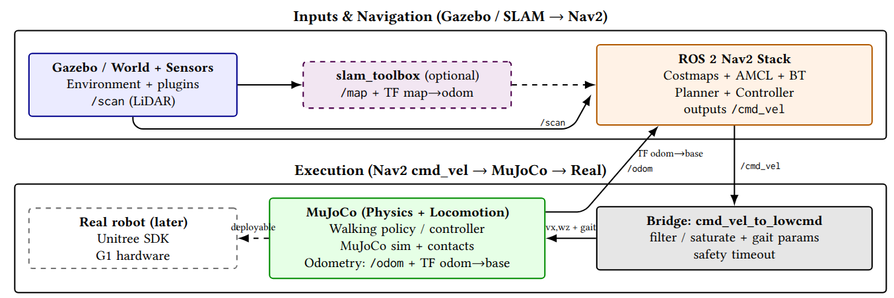

# Navigation-Aware Hybrid Execution Stack for Unitree G1
## Hybrid Navigation + Locomotion (Gazebo/Nav2 + MuJoCo + Real)


[](https://ubuntu.com/)
[](https://www.apple.com/macos/)
[](https://wiki.ros.org/noetic)
[](https://wiki.ros.org/foxy)
[](https://navigation.ros.org/)
[](https://github.com/SteveMacenski/slam_toolbox)
[](https://www.unitree.com/)
[]()
[](http://gazebosim.org/)
[](https://mujoco.org/)
[](https://opensource.org/license/apache-2-0)

This repository implements **a navigation-driven hybrid execution framework** for the Unitree G1 humanoid robot.
It builds upon the locomotion pipeline provided by [rl_sar](https://github.com/fan-ziqi/rl_sar) (Ziqi Fan) which offers a robust SIM–REAL reinforcement learning locomotion stack.

We extend and adapt this pipeline to integrate:

- ROS 2 Nav2-based SLAM and global planning

- Navigation-driven /cmd_vel control

- MuJoCo–Gazebo pose synchronization

- Structured deployment workflow for real robot execution

While [rl_sar](https://github.com/fan-ziqi/rl_sar) focuses on locomotion policy deployment,
this project introduces a navigation-first architecture, where high-level planning and SLAM drive physics-grounded RL locomotion in a unified execution stack.

The same command interface (/cmd_vel) is preserved across all deployment levels:

Simulation (Gazebo + MuJoCo)
        ↓
Hardware-in-the-loop testing
        ↓
Real robot execution (Unitree G1 / G1 EDU23)

This enables consistent experimentation and reproducible evaluation from simulation to hardware.

## Hybrid Execution Architecture
The system is organized into four interacting layers:

**1️⃣ Navigation Layer (ROS 2 Nav2 + SLAM)**

- Mapping via slam_toolbox

- Localization

- Global and local planning

- /cmd_vel generation

Nav2 decides **where the robot should move**.

**2️⃣ Locomotion Layer (MuJoCo + RL Policy)**

- Physics-grounded locomotion

- 29-DoF Robomimic-based RL controller

- Joint remapping from policy space (29 DoF) to hardware space (23 active joints on EDU23)

The RL controller determines **how the robot walks**.

**3️⃣ Hybrid Bridge Layer**

A dedicated bridge ensures consistency between navigation and locomotion:

- /cmd_vel filtering and saturation

- Safety timeouts (freshness gating)

- Gait parameter handling

- Pose synchronization (MuJoCo → Gazebo)

- Unified interface for simulation and real deployment

This layer guarantees that planning outputs are safely transformed into locomotion inputs.

**4️⃣ Deployment Layer (SIM → REAL)**

The framework supports multiple runtime modes:

- Simulation (MuJoCo only)

- Hybrid Gazebo + MuJoCo navigation

- Fake LowState testing (safe debugging)

- Real robot mode via Unitree SDK2

All modes share the same execution logic and command interface.

**Core Design Principle**

The architecture follows a strict separation of responsibilities:

  - Navigation decides where to go

  - RL locomotion decides how to walk

  - The bridge guarantees execution consistency

This modular structure enables:

Navigation-aware humanoid locomotion

Stable sim-to-real policy transfer

Controlled evaluation of SLAM + RL stacks

Reproducible experiments across simulation and hardware

---



## Real Robot Deployment Mode

In real deployment mode:

  - The RL locomotion controller runs on the hardware interface

  - Low-level state feedback (LowState) is streamed from the robot (DDS)

  - Nav2 (running on the PC) generates /cmd_vel

  - The bridge applies safety gating before publishing LowCmd

Safety mechanisms include:

  - Command freshness timeout

  - Motor enable sequence

  - Navigation-mode gating

  - Controlled activation of LowCmd publishing

This design ensures consistent behavior across simulation and real-world experiments while preserving hardware safety.

---

## Research Objective

Beyond system integration, this project investigates how:

  - Execution reliability

  - Structured operational modes

  - Transparency in control flow

jointly influence **trust in service robotics**.

Rather than focusing solely on perception or reasoning modules, we emphasize the importance of a validated execution backbone that:

  - Reduces navigation instability

  - Improves motion predictability

  - Supports explainable operational modes

  Enables systematic evaluation of safety and user trust

By unifying simulation, hardware-in-the-loop testing, and real robot deployment under a shared Nav2-based execution substrate, this framework enables principled research on navigation-driven humanoid robotics.


## Requirements

Recommended: **Ubuntu 22.04 + ROS 2 Humble + Gazebo Classic (Gazebo 11)**

### Core dependencies
- C++17 toolchain + CMake
- ROS 2 Humble
- Gazebo Classic + `gazebo_ros_pkgs`
- Nav2 + RViz2
- `yaml-cpp`, `TBB`, `glfw3`
- Python3 (dev headers)
- MuJoCo runtime library:** `libmujoco.so.3.2.7`

---

## Behavior Matrix

This project supports multiple execution modes with a **single binary** (no rebuild),
selected at runtime via ROS 2 parameters.

### Runtime parameters
- `hw_mode`:
  - `0` = `REAL` (reads real robot LowState via DDS)
  - `1` = `FAKE_LOWSTATE` (synthetic LowState, no robot required)
- `fake_rl_full` (only meaningful when `hw_mode=1`):
  - `false` = mapping/cmd_vel checks only (no RL forward)
  - `true`  = full RL forward + logs (still safe if `publish_lowcmd=false`)
- `publish_lowcmd`:
  - `true`  = publish LowCmd to the robot (movement possible)
  - `false` = never publish LowCmd (safe dry-run)

> **Safety rule:** `LowCmd` is published **only** when `hw_mode=REAL` and `publish_lowcmd=true`.

### Mode matrix

| Mode | LowState source | RL Forward | LowCmd computed | LowCmd published | Primary goal |
|---|---|---:|---:|---:|---|
| `REAL` + `publish_lowcmd=true` | Real robot (DDS) | ✅ | ✅ | ✅ | Real robot operation (navigation → locomotion) |
| `REAL` + `publish_lowcmd=false` | Real robot (DDS) | ✅ | ✅ | ❌ | Safe debugging on robot (no motion output) |
| `FAKE_LOWSTATE` + `fake_rl_full=false` | Synthetic | ❌ | ❌ | ❌ | Validate joint mapping + `/cmd_vel` reception only |
| `FAKE_LOWSTATE` + `fake_rl_full=true` + `publish_lowcmd=false` | Synthetic | ✅ | ✅ | ❌ | Full RL pipeline + logs without robot (safe) |


## Install dependencies (Ubuntu 22.04)

```bash
sudo apt update
sudo apt install -y   build-essential cmake git   python3 python3-dev python3-pip   libtbb-dev libyaml-cpp-dev   libglfw3-dev pkg-config

# ROS2 + Nav2 + RViz
sudo apt install -y   ros-humble-rclcpp ros-humble-geometry-msgs   ros-humble-navigation2 ros-humble-nav2-bringup   ros-humble-rviz2   ros-humble-tf2-ros ros-humble-tf2-tools   ros-humble-robot-state-publisher   ros-humble-joint-state-broadcaster   ros-humble-std-srvs

# Gazebo Classic + ROS bridge
sudo apt install -y gazebo
sudo apt install -y ros-humble-gazebo-ros-pkgs ros-humble-gazebo-msgs
```

---

## MuJoCo installation (libmujoco.so.3.2.7)

This repository expects MuJoCo under:

```
rl_hnav/src/rl_sar/library/mujoco/
  include/mujoco/mujoco.h
  lib/libmujoco.so.3.2.7
```

Check:

```bash
ls -lah rl_hnav/src/rl_sar/library/mujoco/lib/libmujoco.so.3.2.7
```

If your repo provides a helper script:

```bash
bash rl_hnav/src/rl_sar/scripts/download_mujoco.sh
```

---

## Clone

```bash
cd ~/
git clone https://github.com/uleroboticsgroup/rl_hnav.git
cd rl_hnav
git submodule update --init --recursive
```

---

## Build (ROS 2 friendly)

```bash
cd ~/rl_hnav
source /opt/ros/humble/setup.bash
colcon build 
source install/setup.bash
```

### Build with MuJoCo enabled (recommended)

```bash
cd ~/rl_hnav
colcon build --cmake-args -DUSE_MUJOCO=ON -DENABLE_REAL_ROBOT=ON
source install/setup.bash
```

---

## Run MuJoCo locomotion (consuming /cmd_vel)

Command (as used in this project):

```bash
source /opt/ros/humble/setup.bash ###(zsh)
source rl_hnav/install/setup.bash ###(zsh)
ros2 run rl_sar rl_mujoco g1 scene_29dof   --ros-args -p navigation_mode:=true -p cmd_vel_timeout_sec:=0.6 -p cmd_vel_topic:=/cmd_vel
```

### Parameters
- `navigation_mode:=true` : use `/cmd_vel` as the command source.
- `cmd_vel_timeout_sec:=0.6` : safety stop if `/cmd_vel` is missing.
- `cmd_vel_topic:=/cmd_vel` : Nav2 default output topic.

---

## Operation procedure (important)

At startup, follow this sequence for safe, stable initialization:

1. In **RViz**, click **Pause** immediately (or pause in the MuJoCo viewer if available).
2. If needed, **Reset** to bring the robot back to a stable standing pose.
3. Press **`0`** to **load the policy**.
4. Press **`1`** to execute **GetUp**.
5. Click **Run/Play** to start stepping and enable locomotion.

Open a new terminal, launch then bring up Nav2 + Gazebo that read (`/odom`) from MuJoCo pose to allow SLAM publishing the map. 
```bash
source /opt/ros/humble/setup.bash ###(zsh)
source rl_hnav/install/setup.bash ###(zsh)
ros2 launch g1_nav2 nav_amcl.launch.py
```
After that:
- MuJoCo publishes odometry (`/odom`) and TF (`odom → base`),
- Nav2 publishes `/cmd_vel`,
- the bridge translates `/cmd_vel` into locomotion inputs.

---

## Hybrid simulation: Gazebo + Nav2 + MuJoCo

Typical workflow uses multiple terminals:

1) **Gazebo Classic** world + sensors  
2) *(Optional)* **slam_toolbox** to create `/map`  
3) **Nav2** to produce `/cmd_vel`  
4) **MuJoCo** locomotion (`rl_mujoco`)  
5) **Bridge** to synchronize pose/state 

### Validate topics
```bash
source /opt/ros/humble/setup.bash ###(zsh)
source rl_hnav/install/setup.bash ###(zsh)
ros2 topic echo /cmd_vel
ros2 topic list | grep -E "/odom|/tf|/scan|/cmd_vel"
```

### TF chain expectation
Nav2 typically requires:
- `map → odom → base_footprint` (or `base_link` depending on your robot)

---

## Real robot (Unitree G1 / G1 EDU23) — staged testing

Recommended progression:
1. **cmd_vel only** (log commands, no actuation)
2. **Fake LowState** (validate mapping + policy plumbing without hardware)
3. **Real LowState, dry-run LowCmd** (subscribe only)
4. **Real LowState + Real LowCmd** (actuation enabled)

> For EDU23, missing joints are masked (policy space stays 29-DoF, hardware has 23 active joints).

---
## RE-BUILD

```bash
cd ~/rl_hnav
rm -rf build/rl_sar install/rl_sar log
colcon build --packages-select rl_sar \
  --cmake-args -DUSE_MUJOCO=ON -DENABLE_REAL_ROBOT=ON

source install/setup.bash
```

## RUN

### Fake mode (full RL test without robot (logs, plots, CSV) still safe)

```bash
source /opt/ros/humble/setup.bash ###(zsh)
source rl_hnav/install/setup.bash ###(zsh)
ros2 run rl_sar rl_real_g1_edu23 wlo1 --ros-args \
  -p hw_mode:=1 -p fake_rl_full:=true -p publish_lowcmd:=false \
  -p navigation_mode:=true -p cmd_vel_topic:=/cmd_vel
```
### Real robot mode operation
```bash
source /opt/ros/humble/setup.bash ###(zsh)
source rl_hnav/install/setup.bash ###(zsh)
ros2 run rl_sar rl_real_g1_edu23 wlo1 --ros-args \
  -p hw_mode:=0 -p publish_lowcmd:=true \
  -p navigation_mode:=true -p cmd_vel_topic:=/cmd_vel -p cmd_vel_timeout_sec:=0.2

```
**wlo1 is the network interface**

## Troubleshooting

### MuJoCo library not found
If you see:
`libmujoco.so.3.2.7: cannot open shared object file`

Check:
```bash
ldd install/rl_sar/lib/rl_sar/rl_mujoco | grep mujoco
```

### No motion
- Ensure `/cmd_vel` is published:
```bash
source /opt/ros/humble/setup.bash ###(zsh)
source rl_hnav/install/setup.bash ###(zsh)
ros2 topic echo /cmd_vel
```
- Increase timeout for testing:
```bash
source /opt/ros/humble/setup.bash ###(zsh)
source rl_hnav/install/setup.bash ###(zsh)
-p cmd_vel_timeout_sec:=2.0
```

---

## Contributing

Wholeheartedly welcome contributions from the community to make this framework mature and useful for everyone. These may happen as bug reports, feature requests, or code contributions.

[List of contributors](CONTRIBUTORS.md)

## Citation

Please cite the following if you use this code or parts of it:

```
@software{jean-2026g1,
  author = {Mayoko Biong J.C, Sánchez-González L., Matellán-Olivera V.,},
  title = {rl_hnav: Navigation-Aware Hybrid Execution Stack for Unitree G1
.},
  url = {https://github.com/uleroboticsgroup/rl_hnav.git},
  year = {2026}
}
```

## License
Apache-2.0 (inherit where applicable). See headers in source files.

## Acknowledgements

1. This project builds upon and extends the following open-source repositories:

- [rl_sar](https://github.com/fan-ziqi/rl_sar)
- [unitreerobotics/unitree_sdk2-2.0.0](https://github.com/unitreerobotics/unitree_sdk2/tree/2.0.0)
- [unitreerobotics/unitree_mujoco](https://github.com/unitreerobotics/unitree_mujoco)
- [google-deepmind/mujoco-3.2.7](https://github.com/google-deepmind/mujoco)

2. This project is funded by the **SWEET (Social aWareness for sErvicE roboTs) Marie Skłodowska-Curie Doctoral Network, grant agreement No 101168792​** 
<div align="center">
  
</div>
